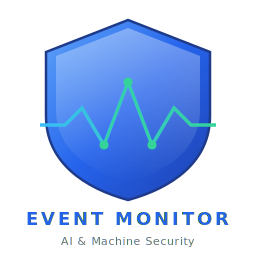

# EventMonitor.Windows

<p align="center">
  
</p>

<p align="center">
  <a href="https://www.powershellgallery.com/packages/EventMonitor.Windows"></a>
  <a href="https://www.powershellgallery.com/packages/EventMonitor.Windows"></a>
  <a href="https://github.com/PowerShell/PowerShell"></a>
  <a href="LICENSE"></a>
</p>

A PowerShell 7.4+ security monitoring module for Windows. Monitors 40+ Windows event IDs across 17 groups using **event-driven, real-time detection** via `EventLogWatcher` — not polling. Supports pluggable telemetry sinks (Application Insights, webhooks, SIEM, or any custom destination).

Runs as a long-running service under the SYSTEM account with automatic self-healing via a built-in watchdog.

## PowerShell Gallery

```powershell
Find-Module EventMonitor.Windows
Install-Module -Name EventMonitor.Windows -Scope CurrentUser
```

### Built for the AI Era

AI coding assistants, agentic bots, and automation tools run with your user context — they can execute commands, open network connections, install packages, and access your files. **EventMonitor.Windows catches what they do:**

- Bot installs a backdoor service → **detected** (4697/7045)
- Compromised package creates a scheduled task → **detected** (4698)
- AI tool opens connections to unknown endpoints → **detected** (5157 blocked, WinRM session)
- Agentic bot disables Windows Defender → **detected** (5001)
- Script clears audit logs to hide activity → **detected** (1102)
- Unknown SSH/RDP access to your machine → **detected** (logon events + SSH/RDP tracking)

Install once, register, forget. Your machine is monitored.

> See [Security & Reliability Design](docs/SECURITY-DESIGN.md) for the full security architecture.

## Features

### Security Event Monitoring (15 Event Groups)

| Group | Events | What It Detects |
|-------|--------|-----------------|
| **Logon** | 4624, 4625, 4648, 4800, 4801 | Successful/failed logons, lock/unlock, explicit credentials |
| **Logoff** | 4647, 4779 | User logoff, RDP disconnect |
| **SSH** | OpenSSH/Operational | SSH connect/disconnect via public key |
| **RDP** | 21, 23, 24, 25 | RDP session logon/logoff/disconnect/reconnect with source IP |
| **AccountManagement** | 4720-4726 | Account created/deleted/enabled/disabled, password changes |
| **GroupManagement** | 4732, 4733 | Members added/removed from security groups |
| **PrivilegeUse** | 4672 | Special privileges assigned (admin logon detection) |
| **ProcessTracking** | 4688, 4689 | Process creation/termination with command line |
| **Persistence** | 4697, 4698, 4702 | Service/task installed (Security log) |
| **PersistenceSystem** | 7045 | New service installed (System log) |
| **AuditTampering** | 1102, 4719 | Audit log cleared, audit policy changed |
| **PowerShell** | 4104 | PowerShell script block execution |
| **NetworkShare** | 5140 | Network share accessed |
| **NetworkFirewall** | 4946-4948, 5152, 5157 | Firewall rule changes, blocked connections |
| **SystemHealth** | 41, 1074, 1076, 6005-6009, 6013 | Shutdown, restart, crash, uptime |

### Architecture

- **Event-driven**: Uses `EventLogWatcher` for instant OS-level event delivery - zero polling, near-zero CPU
- **Self-healing watchdog**: Auto-restarts failed watchers, catch-up sweep fills gaps, health telemetry
- **Pluggable telemetry sinks**: Application Insights built-in; add webhooks, email, SIEM via `Register-TelemetrySink`
- **Monitoring levels**: `Minimum`, `Standard` (recommended), `High`, `Custom`
- **Event journal**: Optional JSONL file capture for AI tools or SIEM without Windows Event Log access
- **Configurable logging**: Operational log level (Error/Warning/Info/Debug) with auto-rotation and retention
- **Active session detection**: `quser` for RDP sessions, `netstat -b` for SSH connections

## Requirements

| Requirement | Details |
|-------------|---------|
| **PowerShell** | 7.4+ (`pwsh.exe`) |
| **OS** | Windows 10/11 Pro/Enterprise, Server 2016+ |
| **Privileges** | Administrator (SYSTEM for scheduled task) |
| **Edition** | `quser` requires Pro/Enterprise/Server (not Home) |
| **Dependencies** | `Microsoft.ApplicationInsights.dll` v3.0.0 (included) |

## Quick Start

```powershell
# 1. Install
Install-Module -Name EventMonitor.Windows -Scope CurrentUser

# 2. Register & start monitoring (Standard level - recommended)
Register-EventMonitor -logAnalyticsConString 'InstrumentationKey=your-key;...'

# 3. Check status
Get-EventMonitor -TaskName 'WinEventMonitor'

# 4. See what is being monitored
Get-EventGroups | Format-Table Name, Enabled, Description
```

## Usage

### Set Monitoring Level

```powershell
Set-MonitoringLevel -Level Minimum     # Logon, Logoff, SSH, RDP only
Set-MonitoringLevel -Level Standard    # + Account, Group, Audit, Persistence, SystemHealth
Set-MonitoringLevel -Level High        # All 15 groups + event journal enabled
Set-MonitoringLevel -Level Custom -Groups 'Logon','SSH','AuditTampering','Persistence'

Get-MonitoringConfig                   # See current config
Get-EventGroups | Format-Table Name, Enabled, Description
```

### Register the Monitor

```powershell
Register-EventMonitor -logAnalyticsConString $connectionString
Register-EventMonitor -logAnalyticsConString $cs -scheduledTaskName 'MyMonitor' -watchdogIntervalMin 15
```

### Manage the Task

```powershell
Get-EventMonitor     -TaskName 'WinEventMonitor'
Stop-EventMonitor    -TaskName 'WinEventMonitor'
Start-EventMonitor   -TaskName 'WinEventMonitor'
Disable-EventMonitor -TaskName 'WinEventMonitor'
Enable-EventMonitor  -TaskName 'WinEventMonitor'
Unregister-EventMonitor -TaskName 'WinEventMonitor'
```

### Event Journal (for AI tools / SIEM)

```powershell
Set-EventJournal -Enabled $true -MinSeverity High -RetentionDays 14
# Files: EventMonitor/Telemetry/Journal/EventJournal-YYYY-MM-DD.jsonl
```

### Custom Telemetry Sinks

```powershell
Register-TelemetrySink -Name 'Webhook' -OnDispatch {
    param($Type, $Name, $Properties)
    if ($Properties['Severity'] -eq 'Critical') {
        Invoke-RestMethod -Uri 'https://hooks.example.com/alert' -Method Post -Body ($Properties | ConvertTo-Json)
    }
}
Get-TelemetrySinks
```

### Diagnostic Scan (One-Shot)

```powershell
Invoke-EventMonitor -LookBackMinutes 60
```

## Running Tests

```powershell
.\Run-Tests.ps1
.\Run-Tests.ps1 -Verbosity Normal
```

## Exported Functions (17)

| Function | Purpose |
|----------|---------|
| `Register-EventMonitor` | Register and start the monitoring service |
| `Unregister-EventMonitor` | Remove the scheduled task |
| `Start-EventMonitor` / `Stop-EventMonitor` | Start/stop the task |
| `Enable-EventMonitor` / `Disable-EventMonitor` | Enable/disable without removing |
| `Get-EventMonitor` | Get task status |
| `Get-WindowsEventsAndSessions` | Run event collection for a user (diagnostic) |
| `Get-MonitoredEventCategories` | List all event categories with severity |
| `Set-MonitoringLevel` | Set level: Minimum / Standard / High / Custom |
| `Get-MonitoringConfig` | View current configuration |
| `Get-EventGroups` | List all event groups and their status |
| `Set-EventJournal` | Configure the JSONL event journal |
| `Set-EMLogLevel` | Set operational log verbosity |
| `Register-TelemetrySink` | Add a custom telemetry destination |
| `Unregister-TelemetrySink` | Remove a telemetry sink |
| `Get-TelemetrySinks` | List registered sinks |

## Contributing

See [CONTRIBUTING.md](CONTRIBUTING.md) for guidelines.

## Security

See [SECURITY.md](SECURITY.md) for vulnerability reporting.

## License

MIT License - see [LICENSE](LICENSE) for details.
